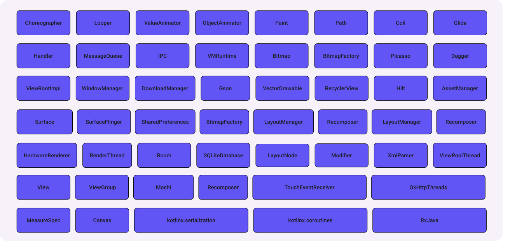

+++
title = 'Frame Timeline: Your Entry Point'
date = 2026-01-07T07:07:07+01:00
draft = false
+++

# Frame Timeline: Your Entry Point for Screen Performance Analysis

**Goal of this article:** To provide a high-level overview of how various components in your app impact UI smoothness.

> **Disclaimer:** > This post assumes you already have a basic understanding of traces and `perfetto-trace` in the context of Android. If not, here are some resources to check out before diving in (or don't, and just keep reading—you’re the master of your own life!):
> * [Tracing 101](https://perfetto.dev/docs/getting-started/start-using-perfetto) – The basics: what tracing is and why it matters.
> * [Record traces on Android](https://developer.android.com/topic/performance/tracing/on-device) – How to capture a trace directly from your device.
> * [FrameTimeline: Jank detection](https://perfetto.dev/docs/data-sources/frametimeline) – How Perfetto actually detects "jank."

---

## Introduction 

`Frame Timeline`, meet my readers. Readers, meet the `Frame Timeline` of an abstract app with some obvious frame duration issues.

### In short: 
- **Expected Timeline:** The expected sequence of frames (the "perfect" frames your mother told you about).
- **Actual Timeline:** The actual sequence of frames from our abstract app.

### TL;DR:
- **Green** = Good.
- **Red** = Bad.

---

## What affects the duration of a frame (or a series of them)?

Whenever I ask myself this question, that meme of the guy standing in front of the corkboard with red strings comes to mind (visualize it). But seriously, here is a list of classes and technologies involved—and it's far from exhaustive.

### Interactive Moment

Take a second to scan this list: Do you know what each individual class or technology on this image actually does?

### The Realization

I’m sure many of you recognize most of these, and that’s great!

But what if I told you that **EVERYTHING** in that image is often used **together** in a single app? Sometimes, they are even active on the same screen at the exact same time.

**Example:** A Big-Tech app with a composite screen where different feature teams are integrated. They share a similar tech stack but have wildly different levels of technical debt.

#### Questions worth answering:

- How do these classes and technologies work together?
- How do they impact one another?
- How do they affect our abstract app in terms of resource utilization?
- Can any of them block the `UI` thread?
- How many resources do they consume individually vs. combined?

---